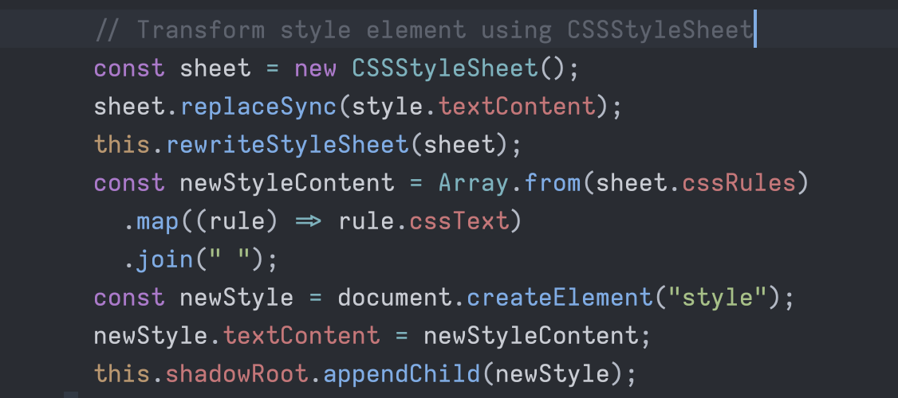

---
id: 114133689156284903
date: 2025-03-09T17:38:07.766Z
---
I've always wanted a write-only mode of mastodon. So that I can just go posting something without any distractions of new posts from my timeline. Combining that plain text, I made this \[mastodon-md\]([https://github.com/29decibel/mastodon-md](https://github.com/29decibel/mastodon-md)). All you need is to write something in the \`queue.md\` file. Then it will be posted (or manually bun run post).

[#plaintext](https://mastodon.social/tags/plaintext) [#mastodon](https://mastodon.social/tags/mastodon) [#writeonly](https://mastodon.social/tags/writeonly)

---
id: 114133615615121550
date: 2025-03-09T17:19:25.620Z
---
Plain text is the most beautiful thing. Now I am publishing a toot from queue.md.

[#plaintext](https://mastodon.social/tags/plaintext) [#mastodon](https://mastodon.social/tags/mastodon)

---
id: 114133310841741385
date: 2025-03-09T16:01:55.142Z
---
Download all your mastodon posts in one markdown file, including attachments.

[https://github.com/29decibel/mastodon-md](https://github.com/29decibel/mastodon-md)

[#mastodon](https://mastodon.social/tags/mastodon) [#markdown](https://mastodon.social/tags/markdown) [#plaintext](https://mastodon.social/tags/plaintext)

---
id: 114117806564089795
date: 2025-03-06T22:18:58.640Z
---
Really appreciate Safari lets you exports all your data easily to plain files. Files lasts forever.

[#safari](https://mastodon.social/tags/safari) [#macos](https://mastodon.social/tags/macos)

---
id: 114090163925012560
date: 2025-03-02T01:09:05.441Z
---
Finally a happy config for Ruby/Elixir using Zed [https://gist.github.com/29decibel/01c04157598ce2adbf0a441be4521689](https://gist.github.com/29decibel/01c04157598ce2adbf0a441be4521689)

[#rubyfmt](https://mastodon.social/tags/rubyfmt) [#ruby](https://mastodon.social/tags/ruby) [#zed](https://mastodon.social/tags/zed)

---
id: 114065652852282503
date: 2025-02-25T17:15:36.166Z
---
Really love Claude code and Aider AI. Any coding AI assistant leaving the terminal already lost the game in my opinion.

---
id: 114050387282709548
date: 2025-02-23T00:33:22.046Z
---
[@collin](https://ruby.social/@collin)

\> I would also argue that in a lot of cases, even if the Ruby approach is less safe, being able to generate methods and properties at runtime can be less error-prone. If I only have to write that code once, it’s a small surface area for bugs.

Well put! I can resonate.

---
id: 114050378350061245
date: 2025-02-23T00:31:05.749Z
---
Apple shortcuts and ssh can pretty much do anything. :-)

[#appleshortcuts](https://mastodon.social/tags/appleshortcuts) [#ssh](https://mastodon.social/tags/ssh) [#scripting](https://mastodon.social/tags/scripting)

---
id: 114050347524051346
date: 2025-02-23T00:23:15.416Z
---
Sugar fridge section

[#AsianDrinks](https://mastodon.social/tags/AsianDrinks) [#BeverageAisle](https://mastodon.social/tags/BeverageAisle) [#ExoticFlavors](https://mastodon.social/tags/ExoticFlavors) [#DrinkDiscovery](https://mastodon.social/tags/DrinkDiscovery)

---
id: 114050345579775648
date: 2025-02-23T00:22:45.711Z
---
Rainy day mood

[#RainyDay](https://mastodon.social/tags/RainyDay) [#CozyVibes](https://mastodon.social/tags/CozyVibes) [#WindowView](https://mastodon.social/tags/WindowView) [#SpringRain](https://mastodon.social/tags/SpringRain) [#RainDrops](https://mastodon.social/tags/RainDrops)

---
id: 114050329414195971
date: 2025-02-23T00:18:39.054Z
---
Colorful flavor

[#Ramune](https://mastodon.social/tags/Ramune) [#JapaneseSoda](https://mastodon.social/tags/JapaneseSoda) [#FlavorAdventure](https://mastodon.social/tags/FlavorAdventure) [#RefreshingDrinks](https://mastodon.social/tags/RefreshingDrinks) [#BeverageLove](https://mastodon.social/tags/BeverageLove)

---
id: 114050318883886131
date: 2025-02-23T00:15:58.364Z
---
Can you see the flag?

[#CarRack](https://mastodon.social/tags/CarRack) [#Pattern](https://mastodon.social/tags/Pattern) [#InnovativeDesign](https://mastodon.social/tags/InnovativeDesign)

---
id: 114050310326648963
date: 2025-02-23T00:13:47.792Z
---
Tree texture

[#NatureDetails](https://mastodon.social/tags/NatureDetails) [#TreeBark](https://mastodon.social/tags/TreeBark) [#UrbanNature](https://mastodon.social/tags/UrbanNature) [#Texture](https://mastodon.social/tags/Texture) [#StreetPhotography](https://mastodon.social/tags/StreetPhotography)

---
id: 114050294812676964
date: 2025-02-23T00:09:51.067Z
---
Sat soccer day

[#SoccerGoals](https://mastodon.social/tags/SoccerGoals) [#PlayOutside](https://mastodon.social/tags/PlayOutside) [#SkyHigh](https://mastodon.social/tags/SkyHigh)

---
id: 114036628097584562
date: 2025-02-20T14:14:13.564Z
---
I was very hesitant to learn another LLM framework, but mastra strikes a beautiful balance of simplicity and power. Love it!

[#llm](https://mastodon.social/tags/llm) [#typescript](https://mastodon.social/tags/typescript)

[https://github.com/mastra-ai/mastra](https://github.com/mastra-ai/mastra)

---
id: 113779273120131333
date: 2025-01-06T03:25:28.231Z
---
Made a simple CLI (npm package) to calculate the best time for commute. 🚘

[#nodejs](https://mastodon.social/tags/nodejs) [#javascript](https://mastodon.social/tags/javascript) [#cli](https://mastodon.social/tags/cli) [#npm](https://mastodon.social/tags/npm)

[https://github.com/29decibel/commute-when](https://github.com/29decibel/commute-when)

---
id: 113777103693621728
date: 2025-01-05T18:13:45.406Z
---
I am very very close to replace all my Apple notes with Logseq. It's so painful to freely (programmable) access notes there.

---
id: 113756125934821571
date: 2025-01-02T01:18:50.211Z
---
Ever wondered how to make writing and sharing frictionless?  
I wrote a simple script that converts Apple Notes folders into static websites, ready to deploy on GitHub Pages. 💡✍️

[#applenotes](https://mastodon.social/tags/applenotes) [#javascript](https://mastodon.social/tags/javascript) [#applescript](https://mastodon.social/tags/applescript) [#writing](https://mastodon.social/tags/writing)

[https://github.com/29decibel/notes-to-blog](https://github.com/29decibel/notes-to-blog)

---
id: 113455398716877872
date: 2024-11-09T22:39:57.021Z
---
The key, again, is not to get the "correct" answer. Rather, it should always prompt us to express what we just learned, using our own words.

---
id: 113455398139683737
date: 2024-11-09T22:39:48.213Z
---
I've had so much faster and effective learning experiences by adopting this approach. Like having conversation when reading source code, reading article or books.

---
id: 113455397495742428
date: 2024-11-09T22:39:38.389Z
---
Traditional RAGs's purpose is always trying to get the "correct" answer. What if that's just a very narrow view of one use case. What if using RAG to help us finding the answers by ourself, using our own word. Basically a constrained RAG, but active our inner learning desires.

---
id: 113455396423325223
date: 2024-11-09T22:39:22.028Z
---
I am more and more convinced that the future of learning is "conversational". Wether reading an article or a book is essentially having a conversation with the author, the process of the conversation is not only turn passive learning to active learning, but also cement the understanding.

---
id: 113449819859923362
date: 2024-11-08T23:01:10.419Z
---
[https://www.youtube.com/watch?v=PIUj8-ig-xU](https://www.youtube.com/watch?v=PIUj8-ig-xU)

---
id: 113449802644342940
date: 2024-11-08T22:56:47.736Z
---
It's really beautiful inside

Mac mini M4

[https://www.youtube.com/watch?v=IO-SeqntnSc](https://www.youtube.com/watch?v=IO-SeqntnSc)

[#mac](https://mastodon.social/tags/mac) [#macmini](https://mastodon.social/tags/macmini)

---
id: 113409843656985702
date: 2024-11-01T21:34:41.987Z
---
So happy to hear Rich Hickey's talk again:

[https://www.youtube.com/watch?v=Earx\_BjvgO0](https://www.youtube.com/watch?v=Earx_BjvgO0)

\> What Clojure is good for is enabling creative people to pursue their vision without getting caught up and distracted by complexity. So it's also a good language therefore for startups but I think more generally - for optimists.

[#clojure](https://mastodon.social/tags/clojure) [#programming](https://mastodon.social/tags/programming)

---
id: 113309456693296955
date: 2024-10-15T04:04:58.469Z
---
Yes I am planning to build something on top of it next.

---
id: 113309455673106689
date: 2024-10-15T04:04:42.912Z
---
fit\_kit is a wrapper gem on top of the awesome Rust crate fitparse\_rs to parse Garmin fit files. [https://github.com/29decibel/fit\_kit](https://github.com/29decibel/fit_kit) [#Ruby](https://mastodon.social/tags/Ruby)

---
id: 113309454565626694
date: 2024-10-15T04:04:26.007Z
---
Finally wrote a Ruby gem after a long time. This time I was trying to integrate with Rust. Among all the tooling around interop with Rust, the DX is still the best in Ruby world. From init to publish to consume. All seamless and enjoyable.💎

---
id: 113182216058599217
date: 2024-09-22T16:46:00.469Z
---
Kamal is so good. It gives you the total control and freedom with raw machines, while offering the first class developer ergonomic and DX right out of the box. From code to production with load balancer and SSL certificates within 15 minutes. [https://kamal-deploy.org/](https://kamal-deploy.org/)

---
id: 113002559241611002
date: 2024-08-21T23:16:54.994Z
---
Looks like Apple podcast (web version) loves Svelte.

[https://podcasts.apple.com/](https://podcasts.apple.com/)

[#applepodcasts](https://mastodon.social/tags/applepodcasts) [#svelte](https://mastodon.social/tags/svelte)

---
id: 112974172235862121
date: 2024-08-16T22:57:43.658Z
---
Apple is a storytelling company hiding behind great products.  
NVIDIA is a storytelling company hiding behind great GPUs.  
Turns out, we as human needs more stories than great products or GPUs.

---
id: 112742386575880872
date: 2024-07-07T00:31:35.166Z
---
This year would be the year of Linux, at least for me.

Thanks to [https://omakub.org/](https://omakub.org/)

Computer is fun again.

---
id: 112729250317198582
date: 2024-07-04T16:50:51.767Z
---
Personally I am so grateful for JRuby, we were able to built so many things in our company using JRuby because we were forced to consume and deploy to JVM. Thank you!

[https://blog.jruby.org/2024/07/independence-day](https://blog.jruby.org/2024/07/independence-day)

[#jruby](https://mastodon.social/tags/jruby)

---
id: 112707918336373775
date: 2024-06-30T22:25:51.578Z
---
Made a simple html viewer for showing external HTML (such as Email newsletter) on a web page. It has no dependencies, just vanilla JS. It also has options such as blocking remote images and removing 1x1 tracking pixels built in.

[https://github.com/orchardlab/ol-html-viewer/](https://github.com/orchardlab/ol-html-viewer/)

[#webcomponents](https://mastodon.social/tags/webcomponents) [#html](https://mastodon.social/tags/html) [#javascript](https://mastodon.social/tags/javascript)

---
id: 112707908227245241
date: 2024-06-30T22:23:17.319Z
---
I like my Palma e-ink reader so much. Start appreciating the versatility of Android. [#eink](https://mastodon.social/tags/eink) [#palma](https://mastodon.social/tags/palma)

[https://www.theverge.com/24184777/boox-palma-e-ink-smartphone-reader](https://www.theverge.com/24184777/boox-palma-e-ink-smartphone-reader)

---
id: 112482030936292972
date: 2024-05-22T00:59:43.381Z
---
Today I learned:

Using \`CSSStyleSheet\` to parse and transform styles on the page.

[#css](https://mastodon.social/tags/css) [#javascript](https://mastodon.social/tags/javascript)

---
id: 112481757279037189
date: 2024-05-21T23:50:07.704Z
---
Only Rust (or maybe Zig) can save JavaScript 🙃

[#rustlang](https://mastodon.social/tags/rustlang) [#javascript](https://mastodon.social/tags/javascript) [#ziglang](https://mastodon.social/tags/ziglang)

---
id: 112470401181622207
date: 2024-05-19T23:42:07.408Z
---
I've been doing software development for a long time. After using all kinds of different languages, tools, frameworks. I finally realized/accepted what's good for myself, what are the things wired the way my brain enjoys.

For me it's always these:

\- Ruby  
\- Elixir  
\- Web components  
\- Vanila JavaScript

And I don't expect these to change any time soon.

[#elixir](https://mastodon.social/tags/elixir) [#webcomponents](https://mastodon.social/tags/webcomponents) [#javascript](https://mastodon.social/tags/javascript) [#ruby](https://mastodon.social/tags/ruby)

---
id: 112470225489412807
date: 2024-05-19T22:57:26.557Z
---
I don't dislike NodeJS. But you can get really really far with Elixir/Rust and Bun without losing your mind.

Created a dead simple script allow me to extract article from web page by leveraging the awesome [https://github.com/mozilla/readability](https://github.com/mozilla/readability) JS library without jumping into the npm world.

[https://github.com/29decibel/readability-cli](https://github.com/29decibel/readability-cli)

\`\`\`bash  
bun out/index.js [https://github.com/mozilla/readability](https://github.com/mozilla/readability)  
\`\`\`

Or single binary:

\`\`\`bash  
./readability-cli [https://bun.sh/docs/bundler/executables](https://bun.sh/docs/bundler/executables)  
\`\`\`

---
id: 112464931861884208
date: 2024-05-19T00:31:12.217Z
---
Very inspiring post, build yourself something. [https://tonsky.me/blog/allekinos/](https://tonsky.me/blog/allekinos/) by [@nikitonsky](https://mastodon.online/@nikitonsky)

---
id: 112454176036714799
date: 2024-05-17T02:55:51.346Z
---
[@reichenstein](https://mastodon.social/@reichenstein) [@wildflower](https://giantheart.social/@wildflower)

\> I think that the iPad, when used for writing only is one of the best writing devices

Can't agree more on this. The single task nature of iPad plus the clean, stylish iA writer is the best way to get some deep thoughts out without any distraction.

---
id: 112453759246383738
date: 2024-05-17T01:09:51.631Z
---
This year's goal is to dive into the rabbit hole of web components (again) and web accessibility.

[#webcomponents](https://mastodon.social/tags/webcomponents) [#a11y](https://mastodon.social/tags/a11y)

---
id: 112453748049646410
date: 2024-05-17T01:07:00.783Z
---
Apple's 100 Best Albums ([https://100best.music.apple.com/us](https://100best.music.apple.com/us)) is so beautifully made.

Apparently they love SvelteKit and CSS variables ❤️

[#sveltekit](https://mastodon.social/tags/sveltekit) [#sveltejs](https://mastodon.social/tags/sveltejs) [#cssvariables](https://mastodon.social/tags/cssvariables)

---
id: 112301093611333932
date: 2024-04-20T02:04:58.907Z
---
This Orion Preview window is amazing! [#orion](https://mastodon.social/tags/orion) [#ivoryapp](https://mastodon.social/tags/ivoryapp)

---
id: 112292759035511940
date: 2024-04-18T14:45:23.371Z
---
[@robb](https://social.lol/@robb) This looks so nice. I wish there is a more hackable device. Does this have full support of Shortcut?

---
id: 112225243320590864
date: 2024-04-06T16:35:15.318Z
---
[@jimniels](https://mastodon.social/@jimniels) This is exactly what in my mind. RSS content with the most original content and style preserved.

---
id: 112219351380805971
date: 2024-04-05T15:36:51.485Z
---
If you don’t have a plan, someone else will make one for you.

---
id: 112215961796934675
date: 2024-04-05T01:14:50.505Z
---
I love StickerBaker. Made my day.

[https://stickerbaker.com/sticker/99251](https://stickerbaker.com/sticker/99251)

---
id: 112187666518218972
date: 2024-03-31T01:18:58.815Z
---
This made me think this wave of LLMs are way different than the web 2.0 wave, especially for startups. But on the other side, I guess companies spent tons of money make unix or Java available for everyone to use as well.

---
id: 112185549962471807
date: 2024-03-30T16:20:42.734Z
---
Other ones on my dock:

\- read.amazon.com - Kindle  
\- manning books  
\- ChatGPT  
\- Feedbin  
\- Discord

---
id: 112185503620239948
date: 2024-03-30T16:08:55.613Z
---
Selfish ask. Can we have a \*write only\* mode for [#PhanpySocial](https://mastodon.social/tags/PhanpySocial) . I would relunctant to say this if not seeing so many interesting ideas (not seeing any where else) showing up in Phanpy.  
\- catch up  
\- boost carousel  
\- image slidding animation  
\- probably more ...

---
id: 112185489817651940
date: 2024-03-30T16:05:25.002Z
---
Manning.com pro subscription is surprisingly good. If you regularly (should) buy one book from them every month, this will save you money. As you can get one book for free every month and reading everything else online for free.

[#manningbooks](https://mastodon.social/tags/manningbooks)

---
id: 112185478676274037
date: 2024-03-30T16:02:35.002Z
---
Phanpy + "Add to Dock..." = Best Mastodon macOS desktop client

[#PhanpySocial](https://mastodon.social/tags/PhanpySocial) [#mastodon](https://mastodon.social/tags/mastodon)

---
id: 112185467790620766
date: 2024-03-30T15:59:48.896Z
---
I seriously believe 2024 would be a year of PWA, well at least for me. The lightweight, always update to date, no single authority (app store), offline support (depends on certain apps), makes it so charming after so many years. Lots of time you just need a browser, but having an "app" concept can effective let you focus on the task at hand.  
Oh yeah, I still miss webOS from Palm.

[#pwa](https://mastodon.social/tags/pwa) [#webos](https://mastodon.social/tags/webos)

---
id: 112137201917642873
date: 2024-03-22T03:25:10.124Z
---
Feels so good writing Elixir on a 4 years old Phoenix app again, everything still working, still feel powerful of doing anything. Liveview is still a magic. This thing just runs forever. [#elixir](https://mastodon.social/tags/elixir) [#phoenix](https://mastodon.social/tags/phoenix)

---
id: 112125157071100955
date: 2024-03-20T00:22:00.351Z
---
[https://phanpy.social/](https://phanpy.social/) is the new height of a great Mastodon web client. [#mastodon](https://mastodon.social/tags/mastodon) [#phanpy](https://mastodon.social/tags/phanpy)

---
id: 111982325354160918
date: 2024-02-23T18:58:01.308Z
---
Want to read more? Go to places.

---
id: 111982186611148550
date: 2024-02-23T18:22:44.259Z
---
Space plays a critical role on my reading experiences. It's not the medium (paper vs eink/screen) matters the most, but where I read decides how much I can absorb the information.  
This could applies to library, train, coffee shop, car.

---
id: 111982044446449542
date: 2024-02-23T17:46:35.016Z
---
Working on Svelte is so rewarding as a long time vanilla JS developer. All the accumulated web knowledge over the years just instantly available to you, while enjoying the augmented DX.

I have to say that's the best thing happened to the web. Imagine you don't need to throw away everything in order to progress, instead just enjoy the compounding benefits of your existing web knowledge.

Thank you Svelte team!

[#svelte](https://mastodon.social/tags/svelte) [#sveltekit](https://mastodon.social/tags/sveltekit) [#web](https://mastodon.social/tags/web) [#webdev](https://mastodon.social/tags/webdev)

---
id: 111977219232680147
date: 2024-02-22T21:19:28.078Z
---
I've been looking for a self hosted good looking photo management app forever.

I think [https://immich.app/](https://immich.app/) nailed it!

I especially love lots of its design choices, fun, simple and elegant.

[#photos](https://mastodon.social/tags/photos) [#opensource](https://mastodon.social/tags/opensource) [#web](https://mastodon.social/tags/web)

---
id: 111973376104782129
date: 2024-02-22T05:02:06.601Z
---
When in doubt. Bet on Linux and the web.

[#linux](https://mastodon.social/tags/linux) [#web](https://mastodon.social/tags/web)

---
id: 111973358304619197
date: 2024-02-22T04:57:34.993Z
---
Most of the cloud services not worth it. You spend more money, facing more weird problems without any support, spending more money, playing a game they want you to play.

No thanks. I will stick with the old Linux server.

[#linux](https://mastodon.social/tags/linux) [#docker](https://mastodon.social/tags/docker)

---
id: 111965983489201681
date: 2024-02-20T21:42:04.239Z
---
\> The web equivalent is: the websites you create — their content and functionally for end users — are more important than the tools you use to create them.

\> What your site is built and served with is ephemeral, but the content is what has a chance to last.

[https://notes.jim-nielsen.com/#2024-02\-19T2244](https://notes.jim-nielsen.com/#2024-02-19T2244)

---
id: 111965972535478852
date: 2024-02-20T21:39:17.097Z
---
Don't delegate your word

This is more relevant than ever with the LLMs. I found myself quickly losing “voice” in order to chase the correctness, perfect.

[https://world.hey.com/jason/don-t-delegate-your-word-1875de99](https://world.hey.com/jason/don-t-delegate-your-word-1875de99)

---
id: 111961287168246070
date: 2024-02-20T01:47:44.070Z
---
The more I use it, the more I love SvelteKit. It has very few but very powerful concepts. Which not only takes you very far, but also gives you a solid foundation.

The only thing I hope would improve would be the printability of the doc.

[#sveltekit](https://mastodon.social/tags/sveltekit)

---
id: 111961274921982251
date: 2024-02-20T01:44:37.206Z
---
SvelteKit “Form actions” is the single most underrated feature. I use it to power 95% of the mutation happens to my projects, I no longer needs that much JSON API endpoints. It's dead simple as it leverages the native web form to send data, you can easily extend it using use:enhance or your own customized handler to provide a better UX.

Oh it works without JS. What a charming thing!

[https://kit.svelte.dev/docs/form-actions](https://kit.svelte.dev/docs/form-actions)

[#sveltekit](https://mastodon.social/tags/sveltekit) [#webdev](https://mastodon.social/tags/webdev) [#webplatform](https://mastodon.social/tags/webplatform)

---
id: 111927790541925593
date: 2024-02-14T03:49:06.112Z
---
[@VinceAggrippino](https://techhub.social/@VinceAggrippino) Updated. Thank you!

---
id: 111927551296667770
date: 2024-02-14T02:48:15.523Z
---
How To Center a Div

[https://www.joshwcomeau.com/css/center-a-div/](https://www.joshwcomeau.com/css/center-a-div/)

If there's anyone in the world who treats writing a blog like shipping a product, it's Josh W. Comeau.

Once again, Josh has nailed it. I've learned a ton from this piece and greatly appreciate all the details.

[#html](https://mastodon.social/tags/html) [#css](https://mastodon.social/tags/css) [#webdev](https://mastodon.social/tags/webdev)

---
id: 111902225067385230
date: 2024-02-09T15:27:27.930Z
---
Like it or not. I often found Rails or those server side rendered frameworks are the first ones to embrace the web. Maybe because they have to due to the deliberately limited usage of JavaScript. Maybe because that's just the core value of their pushing to simplicity and less code.

Examples:  
[https://trix-editor.org/](https://trix-editor.org/) Web components (custom elements) rich text editor

[https://github.com/hotwired/turbo/releases/tag/v8.0.0](https://github.com/hotwired/turbo/releases/tag/v8.0.0) Turbo supports View Transition API [https://github.com/hotwired/turbo/pull/935](https://github.com/hotwired/turbo/pull/935)

import map [https://github.com/rails/importmap-rails](https://github.com/rails/importmap-rails)

[#rails](https://mastodon.social/tags/rails) [#web](https://mastodon.social/tags/web)

---
id: 111897031425640095
date: 2024-02-08T17:26:39.247Z
---
GPUI from Zed is so cool. Applying Tailwind CSS to native development in Rust GUI development is super fun!

[https://www.gpui.rs/](https://www.gpui.rs/)

To the infinity and beyond 🚀

[#rust](https://mastodon.social/tags/rust) [#gui](https://mastodon.social/tags/gui) [#zed](https://mastodon.social/tags/zed) [#tailwind](https://mastodon.social/tags/tailwind)

---
id: 111885642659788035
date: 2024-02-06T17:10:20.546Z
---
I am amazed by the causal usage (in an elegant way) of web components in a server side rendering environment from [@feedbin](https://feedbin.social/@feedbin)

If you are wondering how to display 3rd party HTML content (like a newsletter) on your web app, or interested to see web components used in the wild, or even wondering if we can deliver outstanding UX using server side rendering. Then you should really checkout [@feedbin](https://feedbin.social/@feedbin)

Plus they are open source.👏

[https://github.com/feedbin/feedbin](https://github.com/feedbin/feedbin)

[#webdev](https://mastodon.social/tags/webdev) [#webcomponents](https://mastodon.social/tags/webcomponents) [#serversiderendering](https://mastodon.social/tags/serversiderendering) [#rss](https://mastodon.social/tags/rss)

---
id: 111885280407415522
date: 2024-02-06T15:38:12.937Z
---
Quick way to improve your Discord mac app launch speed:

\- Open [https://discord.com](https://discord.com) using Safari  
\- Login  
\- File -> Add to Dock…  
\- Remove Discord from /Applications

Cheers!

---
id: 111871340023673037
date: 2024-02-04T04:32:59.564Z
---
OK I admit I have some unreasonable obsessions over webkit based browsers.

[#webkit](https://mastodon.social/tags/webkit) [#safari](https://mastodon.social/tags/safari) [#orion](https://mastodon.social/tags/orion) [#duckduckgo](https://mastodon.social/tags/duckduckgo)

---
id: 111870097030406495
date: 2024-02-03T23:16:52.991Z
---
Never realized that you can deploy multiple environments to fly.io so easily, I wrote a short blog about it:

[https://orchardlab.dev/posts/fly-envs/](https://orchardlab.dev/posts/fly-envs/)

[#flyio](https://mastodon.social/tags/flyio)

---
id: 111869141644500335
date: 2024-02-03T19:13:54.961Z
---
This for sure feels like magic.

flyctl regions list  
fly scale count 1 --region=bom

[#flyio](https://mastodon.social/tags/flyio)

---
id: 111869030718368940
date: 2024-02-03T18:45:42.358Z
---
Serverless is killing me..

---
id: 111864679576914043
date: 2024-02-03T00:19:09.212Z
---
2024 is for sure going to be crazy. Vision Pro is throwing entire UI on your face so you can't “look away”, while at the same time, LLMs are trying to get rid of as much UI as possible.

What a balance.

[#llm](https://mastodon.social/tags/llm) [#visionpro](https://mastodon.social/tags/visionpro)

---
id: 111864658767800446
date: 2024-02-03T00:13:51.696Z
---
Got way more better result using Apple's Vision framework doing OCR than pytesseract.

[#swift](https://mastodon.social/tags/swift) [#ocr](https://mastodon.social/tags/ocr)

---
id: 111831323081286673
date: 2024-01-28T02:56:09.481Z
---
Base CSS for your text-based pages  
[https://blog.cassidoo.co/post/base-css/](https://blog.cassidoo.co/post/base-css/)

This is absolutely beautiful!

[#html](https://mastodon.social/tags/html) [#css](https://mastodon.social/tags/css)

---
id: 111831201934994678
date: 2024-01-28T02:25:20.933Z
---
Unfortunately, the article extraction of Feedbin seems not on par with [@NetNewsWire](https://micro.blog/activitypub/NetNewsWire) . Plus, it's so cozy to have it running locally somehow again.

---
id: 111825631303871626
date: 2024-01-27T02:48:39.852Z
---
Custom service is such a underrated feature from @feedbin. I love its open-ness, there are APIs too. It has the clean, taste of NetNewsWire but more open.

Plan to migrate NetNewsWire to it soon. The main problem with NetNewsWire is I can't easily export items or starred articles.

---
id: 111820141671779674
date: 2024-01-26T03:32:34.709Z
---
This talk is gonna be a hit. I love this!

[#sveltekit](https://mastodon.social/tags/sveltekit) [#svelte](https://mastodon.social/tags/svelte)

---
id: 111820132139411629
date: 2024-01-26T03:30:09.260Z
---
Now I realized this is the “Don’t touch my file.” feature 🐻‍❄️

[#sveltekit](https://mastodon.social/tags/sveltekit) [#svelte](https://mastodon.social/tags/svelte)

---
id: 111820122211269277
date: 2024-01-26T03:27:37.767Z
---
You don't know how much I appreciate this decision from Svelte team.

SvelteKit is the only one can convince my brain how everything should work together.

[https://www.youtube.com/watch?v=uXCipjbcQfM](https://www.youtube.com/watch?v=uXCipjbcQfM)

[#sveltekit](https://mastodon.social/tags/sveltekit) [#svelte](https://mastodon.social/tags/svelte)

---
id: 111819781042753797
date: 2024-01-26T02:00:51.949Z
---
This local ollama makes me so excited.

[https://github.com/ollama/ollama](https://github.com/ollama/ollama)

---
id: 111818469957830419
date: 2024-01-25T20:27:26.384Z
---
[@jakelazaroff](https://mastodon.social/@jakelazaroff) Or maybe people would have the incentive to make a new browser engine finally.

---
id: 111818462259447532
date: 2024-01-25T20:25:28.912Z
---
iOS 17.4 Introduces Alternative App Marketplaces With No Commission in EU

[https://simonwillison.net/2024/Jan/25/ios-174/](https://simonwillison.net/2024/Jan/25/ios-174/)

As much as I love webkit, I am still very excited about the landing of non webkit browsers on iOS.

---
id: 111773723602619224
date: 2024-01-17T22:47:51.186Z
---
Never fall in love with a corporation

[https://inessential.com/2024/01/17/corporations\_are\_not\_to\_be\_loved](https://inessential.com/2024/01/17/corporations_are_not_to_be_loved)

---
id: 111756182918459327
date: 2024-01-14T20:27:01.585Z
---
Really love and excited about

\- smaller web (without depending on cloud)  
\- SQLite for your entire product  
\- PWA

[https://world.hey.com/dhh/rails-world-and-rails-8-in-2024-c7b090ba](https://world.hey.com/dhh/rails-world-and-rails-8-in-2024-c7b090ba)

[#sqlite3](https://mastodon.social/tags/sqlite3) [#rails](https://mastodon.social/tags/rails) [#pwa](https://mastodon.social/tags/pwa)

---
id: 111715980058001025
date: 2024-01-07T18:02:54.619Z
---
Could 2024 be the explosion year of PWA?

[#pwa](https://mastodon.social/tags/pwa) [#web](https://mastodon.social/tags/web)

[https://world.hey.com/dhh/happiness-is\-never-having-to-ask-for-permission-20962d41](https://world.hey.com/dhh/happiness-is-never-having-to-ask-for-permission-20962d41)

---
id: 111715972798331287
date: 2024-01-07T18:01:04.303Z
---
Til this day I am still hoping webOS could've happened. In my option not only it pioneered some of amazing UX, but might also give us a more freedom because of the web tech it's based upon.

[#webOS](https://mastodon.social/tags/webOS) [#web](https://mastodon.social/tags/web)

---
id: 111707233887706262
date: 2024-01-06T04:58:38.651Z
---
There is always the beauty of self built tool, not only you enjoy the process of making, but also enjoy the peaceful time of using it.

[https://www.robinsloan.com/notes/home-cooked-app/](https://www.robinsloan.com/notes/home-cooked-app/)

[#buildyourself](https://mastodon.social/tags/buildyourself) [#selfhosted](https://mastodon.social/tags/selfhosted)

---
id: 111687568023586741
date: 2024-01-02T17:37:21.378Z
---
“React Server Components" is such an overloaded term. Everyone seems to be talking about different things.

[#react](https://mastodon.social/tags/react)

---
id: 111672656146050997
date: 2023-12-31T02:25:04.185Z
---
Working on a project with clear backend and frontend separation is miserable. As the backend engineers are optimizing for a different target than frontend. Well designed, elegant data models turns out to be 5 API calls to render a single simple screen.

I am not a big fan of the “full stack” phrase, but vertical development is truly amazing to deliver things faster. Also arguably better as it's more coherent.

[#fullstack](https://mastodon.social/tags/fullstack) [#frontend](https://mastodon.social/tags/frontend)

---
id: 111570653840526054
date: 2023-12-13T02:04:32.520Z
---
I immediately miss Elixir/Phoenix in the moment I am looking at a large NextJS codebase.

[#elixir](https://mastodon.social/tags/elixir) [#phoenixframework](https://mastodon.social/tags/phoenixframework) [#liveview](https://mastodon.social/tags/liveview)

---
id: 111542558783032265
date: 2023-12-08T02:59:36.033Z
---
This once again reminds me the beauty of the web!

[https://svg-tutorial.com/](https://svg-tutorial.com/)

[#web](https://mastodon.social/tags/web) [#svg](https://mastodon.social/tags/svg)

---
id: 111534433041176168
date: 2023-12-06T16:33:06.982Z
---
Fantastic episode from CORECURSIVE [https://corecursive.com/vue-with-evan-you/](https://corecursive.com/vue-with-evan-you/)

Evan You's Full-Time Gamble on Open Source

Really inspiring!

---
id: 111512615538437954
date: 2023-12-02T20:04:38.313Z
---
Download links

[https://www.htmhell.dev/tips/download-links/](https://www.htmhell.dev/tips/download-links/)

So much treasure on this site. Knowledge is power!

[#html](https://mastodon.social/tags/html)

---
id: 111511890468617380
date: 2023-12-02T17:00:14.623Z
---
Social network is like email, I really don’t know how you can make some of the people ads free still without sacrificing their privacy. Or is this more like paying to cover their eyes? For that I don’t know why people would choose to pay.

[https://justin.searls.co/links/2023-12\-02-meta-s-overpriced-ad-free-subscriptions-make-privacy-a-luxury-good-eu-suit-ars-technica/](https://justin.searls.co/links/2023-12-02-meta-s-overpriced-ad-free-subscriptions-make-privacy-a-luxury-good-eu-suit-ars-technica/)

---
id: 111507570365678690
date: 2023-12-01T22:41:35.083Z
---
The best thing of Mastodon is I never once receive an email from them, like ever. ❤️

---
id: 111507429179612012
date: 2023-12-01T22:05:40.754Z
---
I need to constantly remind my self that this is a nonfiction book while reading Elon Musk.

---
id: 111507131448636295
date: 2023-12-01T20:49:57.790Z
---
One incentive why I want to build software for myself is that there is simply no software allow me to pay more to get less features.

[#buildyourself](https://mastodon.social/tags/buildyourself) [#lessismore](https://mastodon.social/tags/lessismore)

---
id: 111500649336417675
date: 2023-11-30T17:21:28.557Z
---
Strive to build low maintenance software should be a goal.

---
id: 111500495691552087
date: 2023-11-30T16:42:24.124Z
---
Declarative Shadow DOM

[https://developer.chrome.com/articles/declarative-shadow-dom/](https://developer.chrome.com/articles/declarative-shadow-dom/)

Absolutely the best thing!

[#WebComponents](https://mastodon.social/tags/WebComponents)

---
id: 111500227920025702
date: 2023-11-30T15:34:18.316Z
---
The entire point and the beauty of static website is that they are self contained and portable. By adding more and more APIs for sure makes it less portable and fragile to some extend. Simplicity is not simple anymore.

[https://www.spicyweb.dev/farewell-jamstack/](https://www.spicyweb.dev/farewell-jamstack/)

[#staticwebsite](https://mastodon.social/tags/staticwebsite) [#jamstack](https://mastodon.social/tags/jamstack)

---
id: 111500142635427651
date: 2023-11-30T15:12:36.946Z
---
Taming Tailwind

[https://aaadaaam.com/notes/taming-tailwind/](https://aaadaaam.com/notes/taming-tailwind/)

Great article by [@aaadaaam](https://mastodon.social/@aaadaaam) It still bothers me sometimes that we think utility class littered HTML is fine.

[#CSS](https://mastodon.social/tags/CSS)

---
id: 111497637935019024
date: 2023-11-30T04:35:38.220Z
---
[@kangaroo5383](https://mastodon.social/@kangaroo5383) 💯 To fix that, I have to open the browser dev tools, select the input field, and do the $0.value = ACCOUNT\_NUMBER in the console. 🫠

---
id: 111496877923922429
date: 2023-11-30T01:22:21.370Z
---
So sad to hear the story about Castro [https://sixcolors.com/post/2023/11/castro-podcast-app-goes-down-and-may-be-dying/](https://sixcolors.com/post/2023/11/castro-podcast-app-goes-down-and-may-be-dying/)

I am so temped to build my own podcast app/service…

---
id: 111496803694402252
date: 2023-11-30T01:03:28.719Z
---
[@sixcolors](https://zeppelin.flights/@sixcolors) Oh no! I’ve always keep coming back to Castro cause the workflow of its design just perfectly match my brain. So sad to hear about it.

---
id: 111495579510391687
date: 2023-11-29T19:52:09.153Z
---
No I am not applying. Thank you!

---
id: 111489051704041232
date: 2023-11-28T16:12:02.732Z
---
[@ia](https://mastodon.online/@ia) One huge difference between AI for driving and AI for writing is that we don’t care about the “coherence” of getting to somewhere, but that “coherence” matters a lot (if that’s not the whole point) for expressing your thoughts using words.

And by using AI in the process of writing disrupting that exact flow, which often turns out to be bad writings no matter how grammatically correct it is.

---
id: 111488856761688390
date: 2023-11-28T15:22:28.148Z
---
Building software for yourself is such an underrated life changing experience, an easy way to get fulfillment and happiness.

[#buildyourself](https://mastodon.social/tags/buildyourself)

---
id: 111488802252601598
date: 2023-11-28T15:08:36.403Z
---
The process of building yourself tools is to understand how your brain works.

---
id: 111488797472573499
date: 2023-11-28T15:07:23.465Z
---
\> When other people build tools for us to use, they either design tools after their own workflows and mental models, or worse, they design it for a mass market of millions of people who all sort-of-but-not-really work and think in similar ways. The result is that mass-market productivity tools don’t fit the way our individual minds are predisposed to work. Instead, to use these tools, we need to bend our workflows to fit around the tools.

Small is beautiful.

---
id: 111488779363617885
date: 2023-11-28T15:02:47.150Z
---
I found so much insights and inspirations from Linus 's  
<Build tools around workflows, not workflows around tools>

[https://thesephist.com/posts/tools/](https://thesephist.com/posts/tools/)

I love small nifty tools, the one tailored to the way of your thinking, your workflow, the tools you created for yourself.

Reading this article just gave me enormous holiday cozy feelings 🎄

[#tools](https://mastodon.social/tags/tools) [#workflows](https://mastodon.social/tags/workflows) [#creativity](https://mastodon.social/tags/creativity)

---
id: 111485982821382263
date: 2023-11-28T03:11:35.297Z
---
htmx-Why I Tend Not To Use Content Negotiation

[https://htmx.org/essays/why-tend-not-to-use-content-negotiation/](https://htmx.org/essays/why-tend-not-to-use-content-negotiation/)

I agree with the approach, but I can also understand the concerns as it's very controversial. Engineers are very allergic to repeat things.

But thinking from another perspective, the Data API might have a entirely different shape than the markup API, because they served in different use case, might have different experiences as well. Having the tendency to always have unified API sometimes actually harm the eventual UX.

---
id: 111484704410740347
date: 2023-11-27T21:46:28.299Z
---
[@curious\_carrot](https://mastodon.social/@curious_carrot) What I found useful to convince the stakeholders is just trying to be honest and customer driven.

Because web components makes the lighter JS and faster user experience, giving engineering “ever green” technology to work on rather than spending huge time dealing with dependencies upgrades, API changes, security risks.

So start from where the stakeholders are, then drive to the same destination so both wins. 😀

---
id: 111484490933396143
date: 2023-11-27T20:52:10.895Z
---
Some no brainer use cases to use web components:

\- Build a 3rd party SDK to render some small elements on other people’s page  
\- UI library supporting multiple frameworks (design systems)  
\- Mainly server side rendering but want one or two interactive component on the page  
\- Chrome extension needs UI

Combining web components with import map, I believe you can get pretty far without jumping into the node/npm black hole. 🕳️

[#WebComponents](https://mastodon.social/tags/WebComponents) [#JavaScript](https://mastodon.social/tags/JavaScript) [#HTML](https://mastodon.social/tags/HTML)

---
id: 111484428810941243
date: 2023-11-27T20:36:22.978Z
---
Really wish we can push more on the overall DX side, for example the style string stuff etc.

---
id: 111484421094430170
date: 2023-11-27T20:34:25.237Z
---
[@paul](https://tapbots.social/@paul) I would argue it’s 5 times nicer 😂

---
id: 111484416527754659
date: 2023-11-27T20:33:15.598Z
---
Wow web components seems picked up a lot of momentum from the community recently 💪

Seems I made the right decision when I was making the Amazon Pay SDK / checkout button ([https://pay.amazon.com](https://pay.amazon.com)) 4 years ago.

\- shadow dom to isolate styles  
\- lightweight SDK (9k) total for the entire JS SDK  
\- no dependencies

Worth mentioning we also used CSS Grid for the button layout. Always fun to write vanilla JS using platform APIs

[https://jakelazaroff.com/words/web-components-eliminate-javascript-framework-lock-in/](https://jakelazaroff.com/words/web-components-eliminate-javascript-framework-lock-in/)

[#WebComponents](https://mastodon.social/tags/WebComponents) [#css](https://mastodon.social/tags/css) [#webplatform](https://mastodon.social/tags/webplatform) [#cssgrid](https://mastodon.social/tags/cssgrid)

---
id: 111483293615450503
date: 2023-11-27T15:47:41.274Z
---
I love the mastodon iOS app Ivory. But sometimes I wish it had a “writing mode”. Where I can only write and share, but can’t read/consume.

[@ivory](https://tapbots.social/@ivory)

---
id: 111483285481277745
date: 2023-11-27T15:45:37.158Z
---
Easy productivity hack: only keep creativity or learning apps on your phone (at least Home Screen)

This is what I have:  
\- Apple Notes  
\- iA writer  
\- Freeform  
\- Music Theory

[#productivity](https://mastodon.social/tags/productivity) [#iAWriter](https://mastodon.social/tags/iAWriter) [#applenotes](https://mastodon.social/tags/applenotes)

---
id: 111478584849462390
date: 2023-11-26T19:50:11.740Z
---
Had a great time writing a little Elixir library to extract dominant colors from given image. It's a wrapper on top of the awesome Rust kmeans-colors crate.

Here you can find more details [https://orchardlab.dev/posts/dominant-colors/](https://orchardlab.dev/posts/dominant-colors/)

Or if you simply want to use it [https://github.com/29decibel/dominant\_colors/](https://github.com/29decibel/dominant_colors/)

[#elixir](https://mastodon.social/tags/elixir) [#RustLang](https://mastodon.social/tags/RustLang) [#livebook](https://mastodon.social/tags/livebook)

---
id: 111478043279548794
date: 2023-11-26T17:32:27.505Z
---
Am I crazy to think the Disney movie Wish is all about decentralized web 😂

[#decentralized](https://mastodon.social/tags/decentralized) [#disney](https://mastodon.social/tags/disney)

---
id: 111477310745605422
date: 2023-11-26T14:26:09.924Z
---
[@jasongorman](https://mastodon.cloud/@jasongorman) I am more optimistic than this. On the surface, yes this might be the feeling everyone get, because customer seems not happy no matter how good the software is until you take away something. But at the same time, there are lots of customer who just left rather than complaining and cheering for you after the bug fixed.

Another perspective is we all break things, but showing the care by fixing them fast is not a bad way to show we care.

---
id: 111473080254083813
date: 2023-11-25T20:30:17.745Z
---
Comparing to Copilot driven development, Stack Overflow driven development is not that bad at all.  
At least it enforces more thinking and conscious involvement .

---
id: 111473066695555437
date: 2023-11-25T20:26:50.861Z
---
[@attila](https://fosstodon.org/@attila) [@ia](https://mastodon.online/@ia)

I love this take:

\> AI is an opportunity if you use the extra processing power it can give us to think deeper, better, clearer.

---
id: 111473043236250002
date: 2023-11-25T20:20:53.179Z
---
I love these cards on my table. It really make a difference.

---
id: 111472981159773901
date: 2023-11-25T20:05:05.692Z
---
[https://teenage.engineering/products/ep-133](https://teenage.engineering/products/ep-133)

Such a beautiful object. I can look at this thing all day. Or maybe I should just create a poster and hang it on my wall.

[#teenageengineering](https://mastodon.social/tags/teenageengineering)

---
id: 111472743722495669
date: 2023-11-25T19:04:42.677Z
---
Progressive enhancement ultimately is about caring, same with accessibility. Do you care enough to break down your services/offering into multiple layers so that more people can benefit from your product.

---
id: 111472687933482149
date: 2023-11-25T18:50:31.408Z
---
So true. I am instantly suspicious on any websites which appears to be“app” like, cause the next JS error is not far away.

On the contrary, the traditional plain server side render web pages feels more trustworthy, as the form submission just works, no spinner all around the page, it's even easier to crawl the page if you have too.

---
id: 111472654312495086
date: 2023-11-25T18:41:58.394Z
---
Oh I mean if you have to use JavaScript, I think Web Components is a pretty good bet.

[#WebComponents](https://mastodon.social/tags/WebComponents)

---
id: 111472624799594434
date: 2023-11-25T18:34:28.062Z
---
That's very unfortunate that we become resume driven engineers

[https://www.youtube.com/watch?v=f5felHJiACE](https://www.youtube.com/watch?v=f5felHJiACE)

---
id: 111472607287728017
date: 2023-11-25T18:30:00.851Z
---
The Unbearable Weight of Massive JavaScript

[https://www.youtube.com/watch?v=f5felHJiACE](https://www.youtube.com/watch?v=f5felHJiACE)

Web doesn't mean JavaScript. Always bet on the web, always bet on HTML and CSS.

[#html](https://mastodon.social/tags/html) [#css](https://mastodon.social/tags/css) [#web](https://mastodon.social/tags/web) Sorry I not gonna include JavaScript here 😂

---
id: 111472598622337345
date: 2023-11-25T18:27:48.627Z
---
How to get best/better web performance?

Just do less. Seriously. (Hint: server side rendering, Phoenix LiveView)

---
id: 111472552012470845
date: 2023-11-25T18:15:57.420Z
---
Added RSS feature to 📨VoidInbox. Now I can generate one feed for all my newsletters.

[https://github.com/29decibel/void\_inbox](https://github.com/29decibel/void_inbox)  
[https://orchardlab.dev/posts/void-inbox/](https://orchardlab.dev/posts/void-inbox/)

[#rss](https://mastodon.social/tags/rss) [#elixir](https://mastodon.social/tags/elixir) [#phoenix](https://mastodon.social/tags/phoenix)

---
id: 111472521429672538
date: 2023-11-25T18:08:10.769Z
---
Writing Elixir (LiveView) is for sure becoming a therapy for me. It makes you feel you can do so much more with so little in an elegant way, so that you can spend more time not programming. While you are doing it, you are harnessing the 100% creativity joy from it.

[#elixir](https://mastodon.social/tags/elixir) [#liveview](https://mastodon.social/tags/liveview)

---
id: 111472418402000572
date: 2023-11-25T17:41:58.687Z
---
Phoenix LiveView is so additive, it often gives you an illusion that you are developing a desktop app where the network is not exist. Plus the power and joy of Elixir. I just don't understand why not everyone is doing this.

[#elixir](https://mastodon.social/tags/elixir) [#liveview](https://mastodon.social/tags/liveview)

---
id: 111466836669911783
date: 2023-11-24T18:02:28.213Z
---
Fun project: Not by AI

[https://notbyai.fyi](https://notbyai.fyi)

---
id: 111422871838483776
date: 2023-11-16T23:41:38.126Z
---
Best day of trail running after the rain 🌧️ ⛅️

[#orangecounty](https://mastodon.social/tags/orangecounty) [#irvine](https://mastodon.social/tags/irvine) [#TrailRunning](https://mastodon.social/tags/TrailRunning) [#Trail](https://mastodon.social/tags/Trail)

---
id: 111421829070126485
date: 2023-11-16T19:16:27.377Z
---
Such a great episode by [@marcoarment](https://mastodon.social/@marcoarment) and [@\_Davidsmith](https://mastodon.social/@_Davidsmith) on the latest Under the Radar.

Highly recommend any software engineers to listen. I found great insights from it.

It’s fun, full of positive attitude and wisdoms. Great engineering means caring.

[https://www.relay.fm/radar/281](https://www.relay.fm/radar/281)

---
id: 111401326304720450
date: 2023-11-13T04:22:19.370Z
---
Another great day for trail running.

[#trailrunning](https://mastodon.social/tags/trailrunning) [#orangecounty](https://mastodon.social/tags/orangecounty) [#irvine](https://mastodon.social/tags/irvine)

---
id: 111358950817674725
date: 2023-11-05T16:45:40.753Z
---
I's such a great find this morning on Bruce's Youtube video [https://www.youtube.com/watch?v=lyOzLyb4lVA](https://www.youtube.com/watch?v=lyOzLyb4lVA)

I've used these things daily in Elixir, Phoenix, but still learns a ton from his videos. And it's fun! [@redrapids](https://genserver.social/users/redrapids)

---
id: 111303206908681301
date: 2023-10-26T20:29:16.208Z
---
So cute!

<BROWSER-WINDOW> WEB COMPONENT

[https://www.zachleat.com/web/browser-window/](https://www.zachleat.com/web/browser-window/)

[#WebComponent](https://mastodon.social/tags/WebComponent)

---
id: 111298580495134466
date: 2023-10-26T00:52:42.730Z
---
I found it's especially useful to ask a question with multiple books.

---
id: 111298563060493545
date: 2023-10-26T00:48:16.702Z
---
Recently I built a desktop app allow me to talk to my books (PDF,epub) locally (using OpenAI key). I asked so many questions which I wouldn't before.

[https://github.com/29decibel/talk-to-my-books](https://github.com/29decibel/talk-to-my-books)

[#typescript](https://mastodon.social/tags/typescript) [#langchainjs](https://mastodon.social/tags/langchainjs) [#OpenAI](https://mastodon.social/tags/OpenAI) [#desktop](https://mastodon.social/tags/desktop)

---
id: 111270742340484242
date: 2023-10-21T02:53:06.203Z
---
NodeJS is really good at making tools, but Elixir is so good at making systems.

---
id: 111264846517266162
date: 2023-10-20T01:53:43.078Z
---
Solving any problem is  
more important than being right.

---
id: 111264798527670959
date: 2023-10-20T01:41:30.817Z
---
When I was young, I always don't understand why my mom always see things in the positive way. Even if clearly things are not showing that way. But over the years, I start realizing the importance of positive thinking. It's not about them, it's about you, it's about if you can let go of yourself, otherwise you would stuck there forever.

[https://world.hey.com/jason/always-cheer-ccd76145](https://world.hey.com/jason/always-cheer-ccd76145)

---
id: 111258059408231743
date: 2023-10-18T21:07:40.024Z
---
Caddy and docker makes self hosting service with https so easy!

---
id: 111257904252993677
date: 2023-10-18T20:28:12.533Z
---
Monorepo is indeed a great tradeoff.

---
id: 111257899706319708
date: 2023-10-18T20:27:03.156Z
---
Microfrontends should be your last resort  
[https://www.breck-mckye.com/blog/2023/05/Microfrontends-should-be-your-last-resort/](https://www.breck-mckye.com/blog/2023/05/Microfrontends-should-be-your-last-resort/)

Another problem with Microfrontends on top of the gigantic complexity is the user experiences most likely sucks. Rarely you will feel the entire UI is from one team, using a micro-frontends lots of times feels like using lots of micro sites within a site.

---
id: 111257866191299876
date: 2023-10-18T20:18:31.831Z
---
Great article. Own your fate.

DON’T BUILD YOUR CASTLE IN OTHER PEOPLE’S KINGDOMS

[https://howtomarketagame.com/2021/11/01/dont-build-your-castle-in-other-peoples-kingdoms/](https://howtomarketagame.com/2021/11/01/dont-build-your-castle-in-other-peoples-kingdoms/)

---
id: 111257860459476899
date: 2023-10-18T20:17:04.297Z
---
Also I've grown into love reading dictionaries these days more and more. I mean just reading the definitions makes feel appreciate words more.

---
id: 111257854886501754
date: 2023-10-18T20:15:39.266Z
---
Great talk from Rich Hickey as always [https://www.youtube.com/watch?v=c5QF2HjHLSE](https://www.youtube.com/watch?v=c5QF2HjHLSE)

"Design in Practice"

[#richhickey](https://mastodon.social/tags/richhickey) [#clojure](https://mastodon.social/tags/clojure)

---
id: 111257850218887810
date: 2023-10-18T20:14:28.072Z
---
Fall in love with the questions

Thoughts on question driven vs TODOs. Fantastic read of book: The Socratic Method.

[https://orchardlab.dev/posts/questions/](https://orchardlab.dev/posts/questions/)

---
id: 111225796317888664
date: 2023-10-13T04:22:44.329Z
---
It has been so much fun writing Elixir and using Bumblebee. It's such a beautiful combination, best of all, with a solid foundation to build and deploy in a scalable manner.

[#elixir](https://mastodon.social/tags/elixir) [#bumblebee](https://mastodon.social/tags/bumblebee)

---
id: 111200609732504127
date: 2023-10-08T17:37:27.542Z
---
So we started with the declarative HTML and CSS, then we write more and more JS, then we found it’s too imperative, so we create frameworks to create HTML in JavaScript in a declarative way..

[#html](https://mastodon.social/tags/html) [#css](https://mastodon.social/tags/css)

---
id: 111189807478717015
date: 2023-10-06T19:50:18.312Z
---
Leica Sofort 2

[https://leica-camera.com/en-int/photography/cameras/sofort-2](https://leica-camera.com/en-int/photography/cameras/sofort-2)

[#leica](https://mastodon.social/tags/leica)

---
id: 111188650699129705
date: 2023-10-06T14:56:07.181Z
---
Making Hard Things Easy - Julia Evans

Such a great talk and amazing blog post. I never saw such carefully crafted talk transcription before. Reading it won't make me miss the video anymore.

[https://jvns.ca/blog/2023/10/06/new-talk--making-hard-things-easy/](https://jvns.ca/blog/2023/10/06/new-talk--making-hard-things-easy/)

---
id: 111188613098557548
date: 2023-10-06T14:46:33.547Z
---
The beauty of questions

Sharing my thoughts on using questions to drive your day rather than TOODs, also recommending a great book - The Socratic method

[https://orchardlab.dev/posts/questions/](https://orchardlab.dev/posts/questions/)

[#socraticmethod](https://mastodon.social/tags/socraticmethod) [#questions](https://mastodon.social/tags/questions)

---
id: 111179269494306835
date: 2023-10-04T23:10:21.340Z
---
I think at first I celebrates ChatGPT to encourage us asking way more questions than before. Finally the era of “fear to ask stupid questions ends”. But at the same time I am worrying if we will ask too many lossy questions, questions we don't even think about twice before saying/typing it.

So I guess it goes both ways. Maybe I should setup the ChatGPT in a way to see my questions more critically, or simply rephrasing the question for me so that I can learn what's are good questions looks like.

---
id: 111145492115228563
date: 2023-09-29T00:00:19.442Z
---
Built a little mac app to let me chat with my books (pdf/epub).

[https://www.producthunt.com/products/talktoyourbooks-mac-app](https://www.producthunt.com/products/talktoyourbooks-mac-app)

Feedbacks are greatly appreciated!

[#ChatGPT](https://mastodon.social/tags/ChatGPT) [#openai](https://mastodon.social/tags/openai) [#ebook](https://mastodon.social/tags/ebook) [#chatpdf](https://mastodon.social/tags/chatpdf) [#electron](https://mastodon.social/tags/electron)

---
id: 111140410634980728
date: 2023-09-28T02:28:02.206Z
---
Tauri's developer experience is really top notch! Also somehow the separation of different languages is less confusing than using Electron, cause you always have clear mind that the Rust code is always on the main thread rather the renderer.

Excited to build more stuff using it in the future.

[#tauri](https://mastodon.social/tags/tauri) [#electron](https://mastodon.social/tags/electron) [#rustlang](https://mastodon.social/tags/rustlang)

---
id: 111117102519000686
date: 2023-09-23T23:40:28.576Z
---
[#imba](https://mastodon.social/tags/imba) on the other hand. Taking a totally different direction, which enables us to write less, so it's more maintainable.

Oh for sure I would much prefer later.

TypeScript is to trying to solve the problem by adding another problem, Imba is to frame the problem in a different way.

---
id: 111117095842037121
date: 2023-09-23T23:38:46.695Z
---
Not sure why I am totally ignored [#imba](https://mastodon.social/tags/imba) when it first came out around 2021 (at least at that time it was posted in HN). But I really really like it when digging deeper. (Yes I was a Ruby developer and I used Coffeescript before).

What's interesting is to build reliable and maintainable software, generally two directions we could go with, one is TypeScript - adding types, so we put lots of guard rails so that it could not go wrong easily as before. But it adds even more code.

---
id: 111116724243037791
date: 2023-09-23T22:04:16.549Z
---
I think I am falling in love with [#imba](https://mastodon.social/tags/imba)  
I know there are so many reasons to not taking this seriously, but look at the number of files for a “fullstack” app. I just can't resist.

[https://imba.io/](https://imba.io/)

---
id: 111116630777711795
date: 2023-09-23T21:40:30.389Z
---
Never know you could send a web page as an email directly from Safari. It also support “Reader” mode! Magic 🪄

[#safari](https://mastodon.social/tags/safari) [#macOS](https://mastodon.social/tags/macOS)

---
id: 111109509558330127
date: 2023-09-22T15:29:29.200Z
---
Softwares optimizing for feelings will be in scarcity.

Optimizing For Feelings

[https://browsercompany.substack.com/p/optimizing-for-feelings](https://browsercompany.substack.com/p/optimizing-for-feelings)

[#arc](https://mastodon.social/tags/arc) [#thebrowsercompany](https://mastodon.social/tags/thebrowsercompany)

---
id: 111083504453046682
date: 2023-09-18T01:16:02.776Z
---
Bun and Prisma fun time.

[#bun](https://mastodon.social/tags/bun) [#prismajs](https://mastodon.social/tags/prismajs)

[https://orchardlab.dev/posts/bun-prisma/](https://orchardlab.dev/posts/bun-prisma/)

---
id: 111071291067244634
date: 2023-09-15T21:30:01.300Z
---
Now I understand why people are so obsessive about trail running. It's so much fun and being able to see the different nature even for the same route every day is so refreshing. [#orangecounty](https://mastodon.social/tags/orangecounty) [#irvine](https://mastodon.social/tags/irvine) [#trailrunning](https://mastodon.social/tags/trailrunning)

---
id: 111069877009349139
date: 2023-09-15T15:30:24.491Z
---
Oh looks like only Elk supports markdown.

---
id: 111069872996863502
date: 2023-09-15T15:29:23.269Z
---
Really love the minimalist \*\*aesthetic \*\*of\*\* \*\*Elk\*\* \*\*[@elk](https://m.webtoo.ls/@elk)

---
id: 111069861048824600
date: 2023-09-15T15:26:20.947Z
---
While people complain about the JavaScript fatigue and never ending "new" things. I start appreciating more of that aspect though. Seeing all kinds of ideas popping up all the time reminds me how much freedom we have on the web. And we should be happy about it.

[https://nuejs.org/](https://nuejs.org/)

---
id: 111069847605535518
date: 2023-09-15T15:22:55.820Z
---
Always bet on the web. [#web](https://mastodon.social/tags/web)

---
id: 111038194185182899
date: 2023-09-10T01:13:02.976Z
---
Playground

[https://orchardlab.dev/posts/playground/](https://orchardlab.dev/posts/playground/)

[#bun](https://mastodon.social/tags/bun) [#typescript](https://mastodon.social/tags/typescript)

---
id: 111032662192095005
date: 2023-09-09T01:46:11.440Z
---
Bun is really a great tool for playground-ish scripts. Like I want to quickly write a TypeScript script, adding couple of npm packages, then run it. No need to mess around with TypeScript configuration, no need to worry about module system. Such a joy to use! [#bun](https://mastodon.social/tags/bun) [#typescript](https://mastodon.social/tags/typescript)

[https://gist.github.com/29decibel/3406ed5139f8b073d8ecea4fad4799d5](https://gist.github.com/29decibel/3406ed5139f8b073d8ecea4fad4799d5)

---
id: 110956947411144780
date: 2023-08-26T16:50:55.572Z
---
Started my 100 days writing challenge. Sharing my thoughts, learnings, tools.

[https://orchardlab.dev/posts/tools/](https://orchardlab.dev/posts/tools/)

[#tools](https://mastodon.social/tags/tools) [#100dayswriting](https://mastodon.social/tags/100dayswriting) [#writing](https://mastodon.social/tags/writing) [#iawriter](https://mastodon.social/tags/iawriter) [#alfred](https://mastodon.social/tags/alfred) [#syncthing](https://mastodon.social/tags/syncthing) [#logseq](https://mastodon.social/tags/logseq) [#dayone](https://mastodon.social/tags/dayone)

---
id: 110956730516228951
date: 2023-08-26T15:55:46.024Z
---
Minimal setup time for your new project

\> Spent dedicated time to think through the foundation can really help you go further.

[https://orchardlab.dev/posts/foundation/](https://orchardlab.dev/posts/foundation/)

[#softwaredevelopment](https://mastodon.social/tags/softwaredevelopment) [#systemdesign](https://mastodon.social/tags/systemdesign)

---
id: 110941647066298632
date: 2023-08-23T23:59:50.835Z
---
Moving forward I want to be more of a SQLite driven builder vs Postgres driven builder. [#sqlite](https://mastodon.social/tags/sqlite) [#localfirst](https://mastodon.social/tags/localfirst)

---
id: 110930229601179196
date: 2023-08-21T23:36:14.145Z
---
As much as a CLI person, I start appreciating more and more on GUI tools. Which reminds me of someone said that we are not living for computing, but computing should work for us. Thank you [@davidbures](https://mstdn.social/@davidbures) for making Cork ❤️ A great GUI for (and more than) Homebrew.

---
id: 110900930624123158
date: 2023-08-16T19:25:07.360Z
---
The ultimate solution for “return less” is to “buy less”. [https://www.newyorker.com/magazine/2023/08/21/the-hidden-cost-of-free-returns](https://www.newyorker.com/magazine/2023/08/21/the-hidden-cost-of-free-returns)

---
id: 110556429900713159
date: 2023-06-16T23:14:03.363Z
---
Really love [@twostraws](https://mastodon.social/@twostraws) ’s 100 days of SwiftUI  
[https://www.hackingwithswift.com/100/swiftui](https://www.hackingwithswift.com/100/swiftui)  
Always find valuable of his teaching, not just about the tech, but also how to learn and the why behind it.

---
id: 110515017134019334
date: 2023-06-09T15:42:14.688Z
---
[@bradellis](https://hachyderm.io/@bradellis) To me this is like a utopia world for kids.

---
id: 110509931744077035
date: 2023-06-08T18:08:57.795Z
---
[@christianselig](https://mastodon.social/@christianselig) That’s very sad to hear. Wish there were a “Mastodon” version of Reddit..

---
id: 110503690241595798
date: 2023-06-07T15:41:40.085Z
---
Apple Human Interface Guidelines is such a great source for almost all software designs. I never thought I could learn a lot from the Writing section: [https://developer.apple.com/design/human-interface-guidelines/writing](https://developer.apple.com/design/human-interface-guidelines/writing)

I plan to have a 100 days reading and sharing my thoughts on Apple HIG. [#appleHIG](https://mastodon.social/tags/appleHIG) [#writing](https://mastodon.social/tags/writing)

---
id: 110503263812427631
date: 2023-06-07T13:53:13.236Z
---
I'm consistently amazed by Volvo's storytelling prowess.

[https://www.youtube.com/watch?v=UBsPUpqSPFs](https://www.youtube.com/watch?v=UBsPUpqSPFs)

[#volvo](https://mastodon.social/tags/volvo) [#storytelling](https://mastodon.social/tags/storytelling) [#ex30](https://mastodon.social/tags/ex30)

---
id: 110494552560693927
date: 2023-06-06T00:57:50.073Z
---
I don't know how I feel about either of them though.

---
id: 110494544508372025
date: 2023-06-06T00:55:47.211Z
---
Love Jason Fried's reflection on the two things this year's unavoidable topics.

"Two visions of the future”  
[https://world.hey.com/jason/two-visions-of-the-future-88e4d9bf](https://world.hey.com/jason/two-visions-of-the-future-88e4d9bf)

---
id: 110319215846044727
date: 2023-05-06T01:47:24.136Z
---
I have to admit that I don't buy into this idea. 10X developer most of the time is not about how fast they can write the code, but how good the thinking are before coding starts. On the contrary, I often felt that in the auto pilot mode makes developer harder to engage when they wanted to. Cause all the little details here and there are all created in different style by “others”.

---
id: 110256192850366237
date: 2023-04-24T22:39:49.542Z
---
I had so much fun recently playing with Web Components (using Lit). Embrace the platform as they say. Gaining the raw performance while knowing the code would still relevant in the future feels good. [#webcomponents](https://mastodon.social/tags/webcomponents) [#embracetheplatform](https://mastodon.social/tags/embracetheplatform) [#lit](https://mastodon.social/tags/lit)

---
id: 110256170757346839
date: 2023-04-24T22:34:12.434Z
---
Back to the future. Plus, 7 is my lucky number.

---
id: 110255801878862278
date: 2023-04-24T21:00:23.839Z
---
2023 will be a year of optimizing the speed of learning. It's faster than ever (thanks to LLMs) to learn something in a very fast pace every single day. This year would be the year of “Instant gratification on learning”. [#LLMs](https://mastodon.social/tags/LLMs) [#optimizeleaning](https://mastodon.social/tags/optimizeleaning)

---
id: 110245076683297229
date: 2023-04-22T23:32:50.291Z
---
Wait, there is a mastodom.social instance 😱

---
id: 110245068359123660
date: 2023-04-22T23:30:43.270Z
---
[@bradellis](https://hachyderm.io/@bradellis) I can’t live without using [https://chrome.google.com/webstore/detail/unhook-remove-youtube-rec/khncfooichmfjbepaaaebmommgaepoid](https://chrome.google.com/webstore/detail/unhook-remove-youtube-rec/khncfooichmfjbepaaaebmommgaepoid) watching YouTube. It’s so peaceful.

---
id: 110244501512412071
date: 2023-04-22T21:06:33.888Z
---
I really want to take a moment to appreciate the progress that the web platform has made. [#penpot](https://mastodon.social/tags/penpot) [#clojure](https://mastodon.social/tags/clojure) [#opensource](https://mastodon.social/tags/opensource)

---
id: 110237878662907097
date: 2023-04-21T17:02:17.212Z
---
Or maybe just create one helping you doing exactly that.

---
id: 110237874596774461
date: 2023-04-21T17:01:15.175Z
---
If you want to create more and consuming less. Use the tool which promotes that.

---
id: 110092383746366046
date: 2023-03-27T00:21:00.983Z
---
I found ChatGPT excels especially for learning frameworks or tools which has poor documentation or limited resources. I learned a lot from it efficiently on AppKit etc.

However, it won't replace the overall design of the software you are trying to build, which I feels like it enabled every developer to be an “architect” rather than knowing every little details of how to achieve individual tasks (not saying it's not important). [#appkit](https://mastodon.social/tags/appkit) [#chatgpt](https://mastodon.social/tags/chatgpt)

---
id: 110091585485286995
date: 2023-03-26T20:58:00.485Z
---
Such a lovely day hiking with family. Always appreciating the green 🌲[#orangecouty](https://mastodon.social/tags/orangecouty) [#hiking](https://mastodon.social/tags/hiking) (Weir Canyon Trail)

---
id: 110011914215882069
date: 2023-03-12T19:16:33.389Z
---
Quota’s AI answer is funny and cold. I don’t want to read another machine generated neutral tone of the pale TLDR version. I want to read people’s opinions, the more opinionated the better, I want to see the human face avatar of the given answer, I want the imperfection of it, the silly part of it. To me the human answer shows beliefs and warm, while all the AI answer cares about is that it “sounds” about right.

---
id: 110002422256359471
date: 2023-03-11T03:02:37.577Z
---
Am I the only one appreciating the Apple Music Classical’s less intelligent, less AI driven, less machine learning endless recommendations, less social features nonsense. Just music, at least that’s what it appears to be. Apple was, and still is a conservative tech company in a way. And I really like that. [#Apple](https://mastodon.social/tags/Apple) [#applemusic](https://mastodon.social/tags/applemusic)

---
id: 110000810410028514
date: 2023-03-10T20:12:42.755Z
---
[@bradellis](https://hachyderm.io/@bradellis) I especially love the feature in Safari can cut any website's section and turn them into a widget. Like at that time I have a little widget for listening music cut from the website version.

---
id: 109796271931875159
date: 2023-02-02T17:15:53.266Z
---
Shadow and front

---
id: 109793375772501580
date: 2023-02-02T04:59:21.376Z
---
[@ben](https://mastodon.adida.net/@ben) seems we can always come up a worse idea to cover up the previous bad idea

---
id: 109763266194619981
date: 2023-01-27T21:22:05.677Z
---
Fall in love with the questions, not answers. [#questions](https://mastodon.social/tags/questions)

---
id: 109763264187178781
date: 2023-01-27T21:21:35.046Z
---
Really love using questions to drive my day of thinking. It’s probably the most productive mechanism I’ve ever used. Logseq’s outlines just makes this process so easy and natural! [#logseq](https://mastodon.social/tags/logseq)

---
id: 109763262324674559
date: 2023-01-27T21:21:06.628Z
---
Speaking of the Mastodon adoption, app like [@Ivory](https://mastodon.social/@Ivory) is almost like a piece of art which greatly helps mass audience uses more of the great underlining service.

---
id: 109763096421986729
date: 2023-01-27T20:38:55.150Z
---
I mean how come you can resist not using this elephant more? [@Ivory](https://mastodon.social/@Ivory)

---
id: 109763089024912427
date: 2023-01-27T20:37:02.286Z
---
Super grateful to see Mastodon exists in this world, it’s like another open protocol for social on top of the open web, we need more decentralized well adopted open protocol like this! [#openweb](https://mastodon.social/tags/openweb) [#mastodon](https://mastodon.social/tags/mastodon)

---
id: 109762901466574548
date: 2023-01-27T19:49:20.366Z
---
Apparently I've been having this account all along, time to revive it. What a great year of open web!

---
id: 99346129889969511
date: 2018-01-14T03:47:20.175Z
---
Looks pretty nice and quite ..

---
id: 99346128977739020
date: 2018-01-14T03:47:06.260Z
---
This is the first toot from Mastodon!

---
id: 98865187427647290
date: 2017-10-21T05:17:20.588Z
---
Nice and unique!
